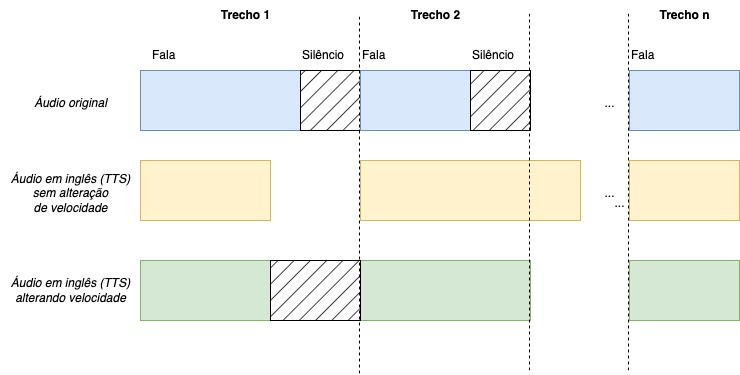

# Desafio Hotmart

## Descrição

Processamento de vídeo usando ferramentas de IA generativa, passando o áudio de português para inglês.

## Estrutura do repositório

O repositório apresenta a estrutura sumarizada abaixo. Conforme arquivos requeridos na [descrição da avaliação]("doc/Cópia_de_Avaliação_de_Cientista_de_Dados_(AI_2024)"), destaca-se:

- Código utilizado para gerar as etapas do teste: `main.py` e módulos constantes em `desafio_hotmart/`

- Arquivo de texto com a transcrição em pt-br: [`data/output/transcription_texto.txt`]("data/output/transcription_texto.txt") (texto "corrido") e [`data/output/transcription_with_timestamps.json`]("data/output/transcription_with_timestamps.json") (texto com marcações de tempo)

- Arquivo de texto com a tradução em inglês: [`data/output/translation_text.txt`]("data/output/translation_text.txt") (texto "corrido") e [`data/output/translation_with_timestamps.json`]("data/output/translation_with_timestamps.json") (texto com marcações de tempo)

- Sample de vídeo final com 3-5 minutos: [`data/output/voice_over_video.mp4`](data/output/voice_over_video.mp4).

```text
├── README.md          <- Informações do projeto e passo-a-passo de como
|                      executá-lo.
|
├── params.yaml        <- Arquivo contendo constantes para configuração.  
|
├── data               <- Dados para o desafio.
│   ├── raw            <- Dados origem (vídeo + áudio extraído).
│   │
│   └── output         <- Saídas do projeto, conforme abaixo:
|                           - texto transcrito: ver em params.yaml:
|                               - data/output/transcribed_text_with_timestamps
|                               - data/output/transcribed_text
|                           - texto traduzido: ver params.yaml:
|                               - data/output/translated_text_with_timestamps
|                               - data/output/translated_text
|                           - áudio gerado: ver em params.yaml
|                               - data/output/translated_audio
|                           - vídeo final: 
|                               - data/output/translated_video
│
├── docs               <- Perguntas do desafio + arquivo drawio para figuras 
|                       + figuras geradas para README.
│
├── notebooks          <- Jupyter notebooks em formato .ipynb utilizados ao longo do projeto.
|
├── poetry.lock        <- gerado por Poetry, fixando dependências do projeto.
|
├── pyproject.toml     <- arquivo de configuração com dependências do projeto.
│
├── desafio_hotmart    <- Módulos desenvolvidos.
│   ├── __init__.py    <- Torna src um módulo Python
│   │
│   ├── video_manipulation.py  <- Scripts para edição de vídeo.
│   │
│   ├── speech_to_text.py      <- Scripts para converter áudio em texto.
│   │
│   ├── translate.py           <- Scripts para traduzir texto.
│   │
│   └── text_to_speech.py      <- Scripts para converter texto em áudio.
│
├── main.py            <- Executa o processo
│
└── .gitignore         
```

## Funcionalidades

Para desenvolvimento do projeto, foram consideradas as seguintes etapas.

<figure>
<div style="text-align: center;">

</div>
</figure>

Os resultados constam abaixo:

Vídeo original:

<video width="320" height="240" controls>
<source src="data/raw/sample_clip.mp4" type="video/mp4">
Your browser does not support the video tag.
</video>

Vídeo traduzido:

<video width="320" height="240" controls>
    <source src="data/output/voice_over_video.mp4" type="video/mp4">
    Your browser does not support the video tag.
</video>

### Processamento do vídeo

Selecionou-se trecho de vídeo, extraindo-se o áudio do mesmo. O processamento consta em `desafio_hotmart/video_manipulation.py`.

### Transcrição do vídeo

A transcrição do vídeo foi realizada pelo modelo Whisper (`openai/whisper-large-v3`) via Hugging Face, conforme `desafio_hotmart/speech_to_text.py`. [No benchmark apresentado pela OpenAI](https://github.com/openai/whisper/discussions/1762), o modelo apresenta Word Error Rate (WER) de 5.9 em português para o dataset Common Voice 15 e 4.1 em FLEURS.

### Tradução da transcrição

#### Métodos utilizados

A tradução do texto transcrito foi realizada pelo modelo ChatGPT 3.5 (`gpt-3.5-turbo`) via API da OpenAI, conforme `desafio_hotmart/translate.py`.

Além do modelo selecionado, tentou-se efetuar a tradução por Google Tradutor via `googletrans`, NLLB distilled via Hugging Face (que apresenta 69 em chrf++ nas traduçõees do português para o inglês), e Llama 2 via Langchain e Ollama.

O Google Tradutor e o NLLB distilled apresentaram dificuldades em traduzir expressões informais, ao exemplo de "Beleza?" que era traduzido como "Beauty?". Além disso, por vezes esses métodos realizavam tradução de marcas.

A utilização de Llama 2 via Langchain e Ollama apresentou resultados irregulares nas respostas trazidas pelo LLM, dificultando sua utilização na tradução. Assim, optou-se por se prosseguir com a solução proprietária.

#### Considerações

A tradução foi realizada para cada trecho acompanhado de sua marcação de tempo conforme obtido na etapa de transcrição de áudio. Em que pese o custo de se perder parte do contexto no momento da tradução, essa solução facilita a sincronização do áudio com o vídeo.

Reconhece-se que o prompt para a tradução está "overfitado" para o trecho traduzido, sendo necessária a avaliação de sua generalização.

#### Performance

Não foi encontrada avaliação da capacidade do ChatGPT em efetuar traduções do português para o inglês, sendo encontrado apenas artigo com traduções com inglês, alemão, chinês e romeno (Jiao et al, 2023), em que os autores destacam a performance do modelo ChatGPT-4. Optou-se por utilizar o ChatGPT-3.5 conforme resultados observados para o caso em tela, bem como visando uma minimização dos custos.

JIAO, Wenxiang et al. Is ChatGPT a good translator? A preliminary study. arXiv preprint arXiv:2301.08745, v. 1, n. 10, 2023.

### Conversão da tradução para áudio

A conversão do texto traduzido para áudio foi realizada via Coqui, utilizando a voz do apresentador.

Pondera-se que [a empresa responsável está fechando](https://github.com/coqui-ai/TTS/issues/3488), e [ainda não é claro qual será o tipo de licença após o shutdown](https://github.com/coqui-ai/TTS/issues/3490). Até então, a [licença permitia uso não comercial](https://coqui.ai/cpml) ou [comercial mediante compra](https://x.com/coqui_ai/status/1730698693781619048?s=20). Assim, o uso dessa solução em cenário produtivo deve ser revisto.

A sincronização do texto com o áudio original foi realizada utilizando os timestamps da transcrição, conforme ilustrado abaixo. Caso o áudio em inglês fosse mais curto (exemplo do _Trecho 1_ da figura), o tempo remanescente era preenchido com silêncio. Caso o áudio em inglês fosse mais longo, acelerava-se o áudio a partir de heurística que permitia o uso do trecho em silêncio observado no áudio original (exemplo do _Trecho 2_ da figura), evitando acelerações excessivas que prejudicassem a qualidade final.

<figure>
<div style="text-align: center;">

</div>
</figure>

O áudio poderia ser avaliado pela métrica qualitativa [Mean Opinion Scores (MOS)](https://huggingface.co/learn/audio-course/chapter6/evaluation), analisando-se critérios de pronúncia, intonação, o quão natural parece o som (_naturalness_) e clareza. Entende-se que a geração do áudio por trechos prejudica a intonação e _naturalness_ do áudio gerado, pois cada trecho pode soar como o início de uma fala.

### Inserção do áudio em inglês no vídeo

Finalmente, a inserção do áudio em inglês no vídeo foi realizada utilizando-se também o módulo `desafio_hotmart/video_manipulation.py`.

## Como reproduzir

Para executar este projeto, siga as etapas abaixo:

1. Clone o repositório em sua máquina local. Você deve ter o [Poetry](https://python-poetry.org/) instalado, bem como o [FFmpeg](https://ffmpeg.org/download.html)
2. Abra o terminal e navegue até o diretório do projeto.
3. Persista o vídeo a ser processado em `data/raw/case_ai (1).mp4`.
4. Crie um arquivo `.env` que possua a chave para API do OpenAI (`OPENAI_API_KEY=sk-...`).
5. Execute o comando abaixo:

```shell
poetry install
poetry run python main.py
```
